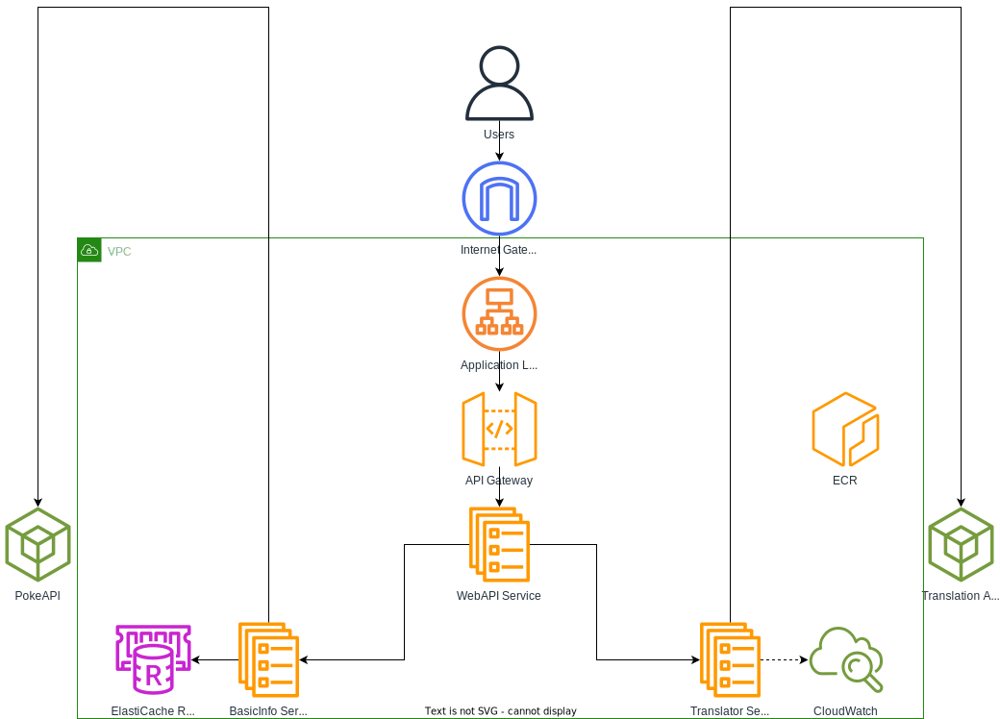

# PokedexApp

A .NET 8 Web API application for Pokémon information.


[](https://codecov.io/gh/ZarakiKanzaki/PokedexApp)

## Getting Started

### Prerequisites

- [.NET 8.0 SDK](https://dotnet.microsoft.com/download/dotnet/8.0) 
- Visual Studio 2022 or [VS Code](https://code.visualstudio.com/) with C# extension
- [Docker Desktop](https://www.docker.com/products/docker-desktop) (optional, for containerization)

### Development Tools

Recommended VS Code extensions:
- C# for Visual Studio Code
- REST Client (for testing API endpoints)
- Docker (if using containerization)

### Building the Project

```bash
# Restore dependencies for all projects
dotnet restore PokedexApp.sln

# Build the entire solution
dotnet build PokedexApp.sln

# Build in Release configuration
dotnet build PokedexApp.sln --configuration Release
```

### Running the Application

#### Local Development
```bash
# Run the Web API (from project root)
dotnet run --project PokedexApp.WebApi

# Or navigate to the WebApi folder and run
cd PokedexApp.WebApi
dotnet run
```

The API will be available at:
- HTTP: `http://localhost:5000`
- HTTPS: `https://localhost:5001`
- Swagger UI: `https://localhost:5001/swagger`

#### Docker

```bash
# Build the Docker image
docker build -f PokedexApp.WebApi/Dockerfile -t pokedexapp .

# Run the container
docker run -p 8080:8080 -p 8081:8081 pokedexapp
```

The containerized API will be available at:
- HTTP: `http://localhost:8080`
- HTTPS: `https://localhost:8081`

### Deployment to AWS

For AWS deployment, the application can be containerized and deployed using:

1. **Amazon ECS with Fargate** - Serverless container deployment
2. **Amazon ECR** - Store Docker images
3. **Application Load Balancer** - Route traffic to services
4. **ElastiCache** - Redis for caching
5. **CloudWatch** - Monitoring and logging

**Deployment Steps:**
```bash
# Build and tag Docker images
docker build -f PokedexApp.WebApi/Dockerfile -t pokedexapp-webapi .

# Tag for ECR (replace with your ECR URI)
docker tag pokedexapp-webapi:latest {account-id}.dkr.ecr.{region}.amazonaws.com/pokedexapp-webapi:latest

# Push to ECR
aws ecr get-login-password --region {region} | docker login --username AWS --password-stdin {account-id}.dkr.ecr.{region}.amazonaws.com
docker push {account-id}.dkr.ecr.{region}.amazonaws.com/pokedexapp-webapi:latest
```

Infrastructure can be managed using AWS CloudFormation, CDK, or Terraform for consistent deployments.

## API Endpoints

### Get Pokémon by Name
```
GET /pokedex/pokemon/{name}
```
Returns basic Pokémon information including name, description, habitat, and legendary status.

**Example:**
```bash
curl https://localhost:5001/pokedex/pokemon/pikachu
```

### Get Translated Pokémon Description
```
GET /pokemon/translated/{name}
```
Returns Pokémon information with translated description (applies fun translations based on habitat and legendary status).

**Example:**
```bash
curl https://localhost:5001/pokemon/translated/pikachu
```

### Swagger Documentation
Interactive API documentation is available at `/swagger` when running the application.

### Running Tests

```bash
# Run all tests
dotnet test PokedexApp.sln

# Run tests with detailed output
dotnet test PokedexApp.sln --verbosity normal

# Run tests for a specific project
dotnet test PokedexAppTest.WebApi
```

### Running with Coverage

```bash
dotnet test --collect:"XPlat Code Coverage" --settings coverlet.runsettings
```

## CI/CD

This project uses GitHub Actions for continuous integration. The workflow:

1. Builds the solution
2. Runs all tests
3. Collects code coverage using coverlet
4. Uploads coverage reports to Codecov

## Setting Up Codecov

To enable code coverage reporting:

1. Go to [codecov.io](https://codecov.io) and sign in with your GitHub account
2. Add your repository to Codecov
3. Copy the repository token from Codecov dashboard
4. Go to your GitHub repository settings → Secrets and variables → Actions
5. Add a new secret named `CODECOV_TOKEN` with the token value
6. The CI workflow will automatically upload coverage reports on each push/PR

## Project Structure

- `PokedexApp.WebApi/` - Web API controllers, middleware, and application entry point
- `PokedexApp.BasicInfo/` - Core domain logic for Pokémon basic information queries
- `PokedexApp.Translator/` - Translation services and related functionality  
- `PokedexApp.Common/` - Shared utilities and common types across projects
- `PokedexAppTest.WebApi/` - Unit and integration tests for Web API
- `PokedexAppTest.BasicInfo/` - Unit tests for basic info logic
- `PokedexAppTest.Translator/` - Unit tests for translator functionality

## Architecture

This solution follows a clean architecture pattern with the following layers:

- **Presentation Layer**: `PokedexApp.WebApi` - REST API endpoints
- **Application Layer**: `PokedexApp.BasicInfo`, `PokedexApp.Translator` - Business logic and queries
- **Common/Shared**: `PokedexApp.Common` - Cross-cutting concerns and shared utilities


## AWS Architecture
Example of AWS Architecture



*[Editable version available as draw.io file](docs/aws-architecture.drawio)*

The application is designed to be deployed as microservices on AWS using the following architecture:

### Components

- **Internet Gateway** - Provides internet access to the VPC
- **Application Load Balancer** - Distributes incoming traffic across services
- **API Gateway** - Manages API routing, rate limiting, and authentication
- **ECS Cluster** - Container orchestration platform running the services:
  - **PokedexApp.WebApi** - Main API gateway service
  - **BasicInfo Microservice** - Handles Pokémon basic information queries
  - **Translator Microservice** - Handles description translation functionality
- **ElastiCache (Redis)** - Caching layer for improved performance
- **ECR** - Container registry for Docker images
- **CloudWatch** - Centralized logging and monitoring

### External Dependencies

- **PokeAPI** - External API for Pokémon data
- **Translation API** - External service for text translation (FunTranslations API)

### Network Architecture

- **VPC** with public and private subnets for security
- **Public Subnet** - Contains load balancers and API Gateway
- **Private Subnet** - Contains ECS services, cache, and internal resources
- All microservices communicate internally within the private network

### Benefits of This Architecture

- **Scalability** - Each microservice can scale independently based on demand
- **Fault Tolerance** - Service isolation prevents cascading failures
- **Security** - Private subnet isolation and API Gateway security controls
- **Monitoring** - Centralized logging and metrics via CloudWatch
- **Performance** - Redis caching reduces external API calls

## Code Coverage

Code coverage is collected using coverlet and uploaded to Codecov. The coverage report includes:

- **Line coverage** - Percentage of executable lines covered by tests
- **Branch coverage** - Percentage of decision branches covered by tests  
- **Method coverage** - Percentage of methods covered by tests

### Local Coverage Reports

```bash
# Generate coverage report locally
dotnet test --collect:"XPlat Code Coverage" --settings coverlet.runsettings

# Install and run reportgenerator for HTML reports
dotnet tool install -g dotnet-reportgenerator-globaltool
reportgenerator -reports:"**/coverage.cobertura.xml" -targetdir:"coveragereport" -reporttypes:Html
```

Coverage reports are automatically generated in CI/CD and available as artifacts in GitHub Actions runs. The coverage data excludes test projects, generated code, and program entry points to focus on meaningful business logic coverage.